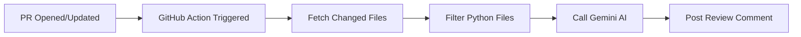

# AI PR Reviewer 🤖

[](https://github.com/features/actions)
[](https://ai.google.dev/)
[](https://opensource.org/licenses/MIT)

An intelligent GitHub Action that automatically reviews Pull Requests using Google's Gemini AI. Get instant, AI-powered code review feedback on every PR.


## ✨ Features

- 🔍 **Multi-Language Support** - Javascript, TypeScript, Python, Java, C++, Go, Rust, and more
- 🤖 **AI-Powered Analysis** - Uses Gemini 2.0 Flash for intelligent feedback
- 💬 **PR Comments** - Posts review directly as PR comments
- ⚡ **Fast & Efficient** - Reviews complete in seconds
- 🔒 **Secure** - API key stored as GitHub secret

## 🚀 Quick Start

### 1. Fork this repository

### 2. Add your Gemini API Key
1. Go to [Google AI Studio](https://aistudio.google.com/apikey) to get your API key
2. In your repository, go to **Settings → Secrets and variables → Actions**
3. Click **New repository secret**
4. Name: `GEMINI_API_KEY`
5. Value: *Your Gemini API key*

### 3. Create a Pull Request
Create a branch, make changes to any `.py` file, and open a PR. The AI reviewer will automatically post a review comment!

## 🔧 How It Works



1. **Trigger**: Workflow runs on PR `opened`, `synchronize`, or `reopened` events
2. **Fetch**: Uses GitHub API to get the list of changed files
3. **Filter**: Identifies Python files (`.py`) for review
4. **Review**: Sends code diff to Gemini AI with a review prompt
5. **Comment**: Posts the AI review as a PR comment

## 📁 Project Structure

```
ai-pr-reviewer/
├── .github/
│   └── workflows/
│       └── pr-review.yml    # GitHub Actions workflow
├── examples/
│   ├── sample-pr.py         # Example code for testing
│   └── sample-functions.py  # More example code
├── README.md
├── SETUP.md                 # Detailed setup guide
└── LICENSE
```

## ⚙️ Configuration

The workflow can be customized by editing `.github/workflows/pr-review.yml`:

| Setting | Default | Description |
|---------|---------|-------------|
| File extensions | All major code | Which file types to review |
| AI Model | `gemini-2.0-flash` | Gemini model to use |
| Review prompt | See workflow | Custom prompt for AI |

## 🛠️ Tech Stack

- **GitHub Actions** - CI/CD automation
- **Google Gemini API** - AI/LLM for code review
- **JavaScript** - Workflow script logic
- **GitHub REST API** - Fetch PR data

## 📝 Example Review Output

```markdown
## 🤖 AI Code Review

### Summary
This PR adds two new mathematical functions: `power` and `square_root`.

### Suggestions
1. Consider adding input validation for negative numbers in `square_root`
2. Add docstrings for better documentation
3. Consider edge case handling for `power(0, 0)`

### Overall
Good implementation with clean, readable code. Minor improvements suggested above.
```

## 🤝 Contributing

Contributions are welcome! Please feel free to submit a Pull Request.

## 📄 License

This project is licensed under the MIT License - see the [LICENSE](LICENSE) file for details.

## 👤 Author

**Ronak Rathod**

---

⭐ Star this repo if you found it helpful!
